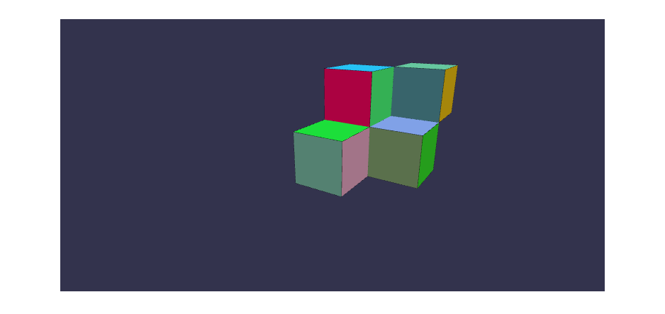

# Babylon Cubes

In this article, a brief introduction to Babylon.js is given to render cubes
into a web page.

## Introduction

Computer simulations are innovative technology in this era. They can help to
visualize industrial processes, real-time processes, running scientific
experiments, and many more.

Computer graphics either 2D or 3D are fundamental to computer simulations so one
can see real-life-looking results. This leads to the development of say, 3D
models so that they can be rendered into a virtual canvas and be interactive. In
order to achieve this result on the internet browser using web technology like
HTML and JS, a library called Babylon.js can be used.

A final result can be run at the [demo page](demo).

## Development

The development consists about adding the Babylon.js library and creating a
script for the page to render some cubes on the HTML Canvas.

### Getting Started

First, create the following files:

- **`index.html`:** webpage entry point.
- **`index.js`:** script with rendering logic.
- **`styles.css`:** basic styles to make the page look better.

Add the following contents to initialize the page.

**index.html**

```html
<!doctype html>
<html lang="en">
  <head>
    <meta charset="utf-8">
    <meta
      name="viewport"
      content="width=device-width, user-scalable=no, initial-scale=1.0, maximum-scale=1.0, minimum-scale=1.0"
    >
    <title>Babylon.js | Cubes</title>
    <link rel="stylesheet" href="styles.css">
  </head>
  <body>
    <canvas id="canvas"></canvas>
    <script src="https://cdn.babylonjs.com/babylon.js"></script>
    <script src="index.js"></script>
  </body>
</html>
```

Notice that Babylon.js is imported via CDN. Also notice the HTML Canvas Element
in which the scene is going to be rendered.

**index.js**

```js
document.addEventListener('DOMContentLoaded', init);

const BOX_SIZE = 50;

function init() {
  const canvasEl = document.getElementById('canvas');
  const main = Main();

  main.init(canvasEl);
  main.draw();
}

function Main() { /* TODO */ }

function newEngine(canvasEl) {
  return new BABYLON.Engine(canvasEl, true, {
    preserveDrawingBuffer: true,
    stencil: true
  });
}

function newCamera(scene) {
  return new BABYLON.ArcRotateCamera(
    'camera1',
    -Math.PI / 2,
    1.2,
    300,
    new BABYLON.Vector3(0, 0, 0),
    scene
  );
}

function newScene(engine) {
  return new BABYLON.Scene(engine);
}

function newBox(scene, name, pos) { /* TODO */ }
```

When the page loads (event DOMContentLoaded) initialize the page (this event is
not needed if you're using ESM). Then define some constructor functions that
will provide the required basic objects. The other two functions are yet to be
implemented.

**styles.css**

```css
* {
  position: relative;
  box-sizing: border-box;
  margin: 0;
  padding: 0;
}

html,
body {
  width: 100%;
}

canvas {
  width: 80%;
  margin: 3% auto;
  display: block;
}
```

### Draw a Basic Scene

Start defining the `Main` function with a basic structure as follows.

**index.js (function `Main`)**

```js
let engine;
let scene;
let camera;
const initCamera = (canvasEl) => {
  camera.setTarget(BABYLON.Vector3.Zero());
  camera.attachControl(canvasEl, true);
};
const runRenderLoop = () => {
  engine.runRenderLoop(() => {
    scene.render();
  });
};

return {
  init: (canvasEl) => {
    engine = newEngine(canvasEl);
    scene = newScene(engine);
    camera = newCamera(scene);

    initCamera(canvasEl);
    runRenderLoop();

    window.addEventListener('resize', () => {
      engine.resize();
    });
  },
  draw() {
    // Sample scene I copied from internet for PoC //

    // Create a basic light, aiming 0, 1, 0 - meaning, to the sky
    const light = new BABYLON.HemisphericLight(
      'light1',
      new BABYLON.Vector3(0, 1, 0),
      scene
    );
    // Create a built-in "sphere" shape; its constructor takes 6 params:
    // name, segment, diameter, scene, updatable, sideOrientation
    const sphere = BABYLON.Mesh.CreateSphere(
      'sphere1',
      16,
      2,
      scene,
      false,
      BABYLON.Mesh.FRONTSIDE
    );
    // Move the sphere upward 1/2 of its height
    sphere.position.y = 1;
    // Create a built-in "ground" shape; its constructor takes 6 params :
    // name, width, height, subdivision, scene, updatable
    BABYLON.Mesh.CreateGround('ground1', 6, 6, 2, scene, false);
  }
};
```

This provides you with a PoC scene, so you can test the results and play a
little with it. If you run the page you should get something like:

**PoC Scene**


### Draw a Cube

Implement the `newBox` function with the following straightforward code:

**index.js (function `newBox`)**

```js
const gizmo = BABYLON.Mesh.CreateBox(name, 10, scene, true);
const addEdges = i => {
  gizmo.slaves[i].enableEdgesRendering();
  gizmo.slaves[i].edgesWidth = 25.0;
  gizmo.slaves[i].edgesColor = new BABYLON.Color4(0, 0, 0, 1);
};

gizmo.isPickable = false;
gizmo.slaves = [];
for (let i = 0; i < 6; i++) {
  gizmo.slaves[i] = BABYLON.Mesh.CreatePlane(name + i, BOX_SIZE, scene, true);
  gizmo.slaves[i].parent = gizmo;
  addEdges(i);
  gizmo.slaves[i].material = new BABYLON.StandardMaterial('mat', scene);
  gizmo.slaves[i].material.diffuseColor = BABYLON.Color3.Random();
  gizmo.slaves[i].material.alpha = 1;
}
gizmo.slaves[0].position = new BABYLON.Vector3(
  pos.x - BOX_SIZE / 2,
  pos.y,
  pos.z
);
gizmo.slaves[0].rotation = new BABYLON.Vector3(0, Math.PI / 2, 0);
gizmo.slaves[1].position = new BABYLON.Vector3(
  pos.x,
  pos.y,
  pos.z + BOX_SIZE / 2
);
gizmo.slaves[1].rotation = new BABYLON.Vector3(0, Math.PI, 0);
gizmo.slaves[2].position = new BABYLON.Vector3(
  pos.x + BOX_SIZE / 2,
  pos.y,
  pos.z
);
gizmo.slaves[2].rotation = new BABYLON.Vector3(0, -Math.PI / 2, 0);
gizmo.slaves[3].position = new BABYLON.Vector3(
  pos.x,
  pos.y + BOX_SIZE / 2,
  pos.z
);
gizmo.slaves[3].rotation = new BABYLON.Vector3(Math.PI / 2, 0, 0);
gizmo.slaves[4].position = new BABYLON.Vector3(
  pos.x,
  pos.y - BOX_SIZE / 2,
  pos.z
);
gizmo.slaves[4].rotation = new BABYLON.Vector3(-Math.PI / 2, 0, 0);
gizmo.slaves[5].position = new BABYLON.Vector3(
  pos.x,
  pos.y,
  pos.z - BOX_SIZE / 2
);
gizmo.slaves[5].rotation = new BABYLON.Vector3(0, 0, 0);
return gizmo;
```

That will simply create a Babylon Box model, add 6 faces to it and set up each
of the faces with position and rotation values to build the cube. More options
can be used but this is more than enough for this article scope. The colors are
randomly generated and border is added to the box faces.

Now update the Main object with the following changes to add light so the colors
can be seen and draw a box into the scene.

**index.js (function `Main`)**

```js
// ... //
const initLight = () => {
  const light = new BABYLON.HemisphericLight(
    'light1',
    new BABYLON.Vector3(0, 1, 0),
    scene
  );
  light.groundColor = new BABYLON.Color3(0.4, 0.4, 0.4);
};
// ... //
return {
  init: (canvasEl) => {
    engine = newEngine(canvasEl);
    scene = newScene(engine);
    camera = newCamera(scene, canvasEl);

    initCamera(canvasEl);
    initLight();
    runRenderLoop();

    window.addEventListener('resize', () => {
      engine.resize();
    });
  },
  draw() {
    newBox(scene, 'box1', { x: 0, y: 0, z: 0 });
  }
};
```

This will look like this:


### Draw many Cubes

As you can see, the `newBox` function takes the coordinates to locate the boxes.
Just pass desired locations to achieve the desired result. Notice that the box
size is a constant that was defined at the start of the script, so you can use
it as a reference. With the following configuration we obtain these results:

**index.js (update function `Main`)**

```js
newBox(scene, 'box1', { x: 0, y: 0, z: 0 });
newBox(scene, 'box2', { x: 0, y: BOX_SIZE, z: BOX_SIZE });
newBox(scene, 'box3', { x: BOX_SIZE, y: 0, z: BOX_SIZE });
newBox(scene, 'box4', { x: BOX_SIZE, y: BOX_SIZE, z: BOX_SIZE * 2 });
```

**Draw many Cubes**



## Conclusion

The Babylon.js library was used to render cubes with coordinates on the HTML
Canvas Element. As an introduction, a basic scene was developed and then the box
model was developed to build a cube from scratch from its 6 faces.

## Bibliography

- [Welcome to Getting Started with Babylon.js \| Babylon.js Documentation](https://doc.babylonjs.com/start)

- [Parametric extrusion edges \| Babylon.js Playground](https://www.babylonjs-playground.com/#TYAHX#123)
