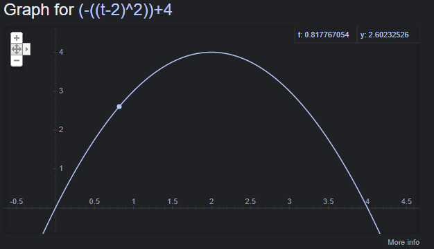
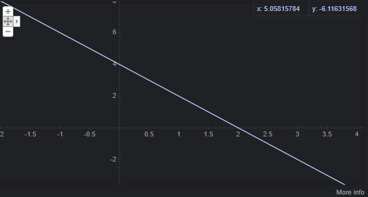

<!--
  ~ Copyright (c) 2022 Tobias Briones. All rights reserved.
  ~ SPDX-License-Identifier: MIT
  ~
  ~ This source code is part of
  ~ https://github.com/tobiasbriones/cp-unah-is910-simulation-theory and is
  ~ licensed under the MIT License found in the LICENSE file in the root
  ~ directory of this source tree or at https://spdx.org/licenses/MIT
  -->

# Projectile Motion

## Introduction

A projectile motion from the kinematics class is described as a parabola or
quadratic equation. First, we have our acceleration vector with magnitude $$g$$
where $$g$$ is gravity equals to $$9.8m/s^2$$, and pointing to the center of the
earth. That is:

$$ \vec{a} = -g \hat{j} $$

So we have that:

$$ \vec{v} = -gt \hat{j} + \vec{v_0} $$

$$ \vec{r} = -\frac{1}{2}gt^2 \hat{j} + \vec{v_0}t $$

Where $$\vec{v_0}$$ is the initial speed.

These equations model a projectile's motion at time $$t$$. If we remove the
parameter from the position vector, and remove the third component to work with
a plane, we get the following shape:

$$ x(t) = t, y(t) = -\frac{1}{2}gt^2$$

Thus, our motion equation describes a parabola or quadratic equation.

### Our Motion

I have selected a good quadratic equation that can be plotted into the 2D-plane.
If you pay close attention, it is easy to get an equation like this:

$$ f(t) = -(t - 2)^2 + 4 $$

That intercepts the axes at the origin, and describes the desired behaviour.
Recall that $$y(t)$$ is negative so the curve is concave down, and to get the
particle motion we need an initial speed.

$$ f'(t) = 4 -2t $$

Clearly, the curve intercepts at the origin, and the maximum point is at
$$t=2$$. The other axis interception is at $$t = 4$$, so our curve is
convenient.



Notice that, this describes the motion of a particle in one dimension, so our
independent variable is time and, our image is the vertical position of the
particle. This is because the $$\hat{j}$$ component of the position equation was
taken. The constant $$4$$ comes from the initial speed.

As elaborated above, I started from the acceleration vector and inferred the
equations that are to be useful for solving this problem. That's how I used to
have the best grades at school, whilst others just trust on formulas, or the
so-called "golden rules". It's crucial to understand math, as math is the
language of everything. I'll give you a bonus next, it is the velocity
(or derivative) and you must be able to relate it to the position function.
Drawing various derivatives is what I used to do when passing Calculus I to have
a clear understanding of the concepts I studied from the books.



## Development

The development consists of using Babylon.js to render a game loop that will
simulate a motion described by our equation. As stated, time will be the x-axis
and position the y-axis.

### Get Started

Create the following files to set up the project:

- [index.html](demo/index.html)
- [styles.css](demo/styles.css)
- [lib.js](demo/lib.js)

Create the index.js for working the animation logic:

```js
document.addEventListener('DOMContentLoaded', init);

const WIDTH = 160;
const HEIGHT = 160;
const OX = -WIDTH / 2;
const OY = -HEIGHT / 2;

function init() {
  const canvasEl = document.getElementById('canvas');
  const main = Main();

  main.init(canvasEl);
}

function Main() {
  let engine;
  let scene;
  let camera;
  const initCamera = (canvasEl) => {
    camera.setTarget(BABYLON.Vector3.Zero());
    camera.attachControl(canvasEl, true);
  };
  const initLight = () => {
    const light = new BABYLON.HemisphericLight(
      'light1',
      new BABYLON.Vector3(OX + WIDTH / 2, OY + HEIGHT / 2, 0),
      scene
    );
    light.groundColor = new BABYLON.Color3(0, 0, 0);
    light.intensity = 0.7;
    scene.clearColor = new BABYLON.Color3(0.9, 0.9, 0.9);
  };
  const runRenderLoop = () => {
    engine.runRenderLoop(() => {
      scene.render();
    });
  };

  return {
    init(canvasEl) {
      engine = newEngine(canvasEl);
      scene = newScene(engine);
      camera = newCamera(scene, canvasEl);

      initCamera(canvasEl);
      initLight();
      runRenderLoop();
      window.addEventListener('resize', () => {
        engine.resize();
      });
    }
  };
}

function newEngine(canvasEl) {
  return new BABYLON.Engine(canvasEl, true, {
    preserveDrawingBuffer: true,
    stencil: true
  });
}

function newCamera(scene) {
  return new BABYLON.ArcRotateCamera(
    'camera1',
    -Math.PI / 2,
    1.2,
    300,
    new BABYLON.Vector3(0, 0, 0),
    scene
  );
}

function newScene(engine) {
  return new BABYLON.Scene(engine);
}
```

This provides an initial framework to start developing the game. This starting
point is taken from the other entries from this course project, such
as [Babylon Cubes](../babylon-cubes) or
[Random Babylon dice](../random-babylon-dice).

### Draw the Axes

I have recently done this in the Repsymo MRM implementation for drawing the
solutions-tree under a xy-plane. I used the bare HTML5 Canvas element, and will
leave the article in the resources section, I highly recommend reading as it
is (my first) first-class entry.

Add the following function to draw the axes:

**index.js `Add function newAxes`**

```js
function newAxes(scene) {
  line2D('y-axis', {
    path: [
      new BABYLON.Vector3(OX, OY, 0),
      new BABYLON.Vector3(OX, OY + HEIGHT, 0)
    ],
    width: 0.5,
    scene
  });
  line2D('x-axis', {
    path: [
      new BABYLON.Vector3(OX, OY, 0),
      new BABYLON.Vector3(OX + WIDTH, OY, 0)
    ],
    width: 0.5,
    scene
  });
}
```

The `line2D` function comes from the `lib.js` file that was added to the 
project from the [Babylon.js Docs](https://doc.babylonjs.com/toolsAndResources/utilities/Line2D).
