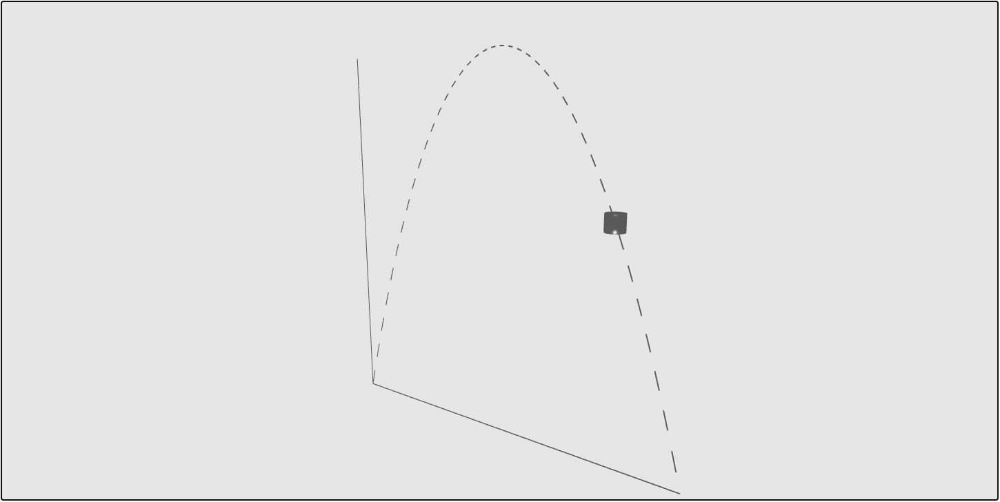

<!--
  ~ Copyright (c) 2022 Tobias Briones. All rights reserved.
  ~ SPDX-License-Identifier: MIT
  ~
  ~ This source code is part of
  ~ https://github.com/tobiasbriones/cp-unah-is910-simulation-theory and is
  ~ licensed under the MIT License found in the LICENSE file in the root
  ~ directory of this source tree or at https://spdx.org/licenses/MIT
  -->

# Projectile Motion

Applying theoretical concepts from courses like Physics or Calculus is a
rewarding endeavor either as a student or professional. An engineer must be
capable of applying abstract concepts on real world problem solutions. In this
exercise, a simulation of a particle in one dimensional motion is developed
employing Babylon.js, and basic kinematics equations for the state model, 
and the quadratic curve to draw as the motion model.



## Contents

- [Projectile Motion](#projectile-motion)
  * [Introduction](#introduction)
    + [Our Motion](#our-motion)
  * [Development](#development)
    + [Get Started](#get-started)
    + [Draw the Axes](#draw-the-axes)
    + [Draw the Curve](#draw-the-curve)
    + [Render the Particle](#render-the-particle)
      - [Draw a Sphere](#draw-a-sphere)
      - [Design the Animation State](#design-the-animation-state)
  * [Result](#result)
  * [Conclusion](#conclusion)
  * [Resources](#resources)
  * [Bibliography](#bibliography)

## Introduction

A projectile motion from the kinematics class is described as a parabola or
quadratic equation. First, we have our acceleration vector with magnitude $$g$$
where $$g$$ is gravity equals to $$9.8m/s^2$$, and pointing to the center of the
earth. That is:

$$ \vec{a} = -g \hat{j} $$

So we have that:

$$ \vec{v} = -gt \hat{j} + \vec{v_0} $$

$$ \vec{r} = -\frac{1}{2}gt^2 \hat{j} + \vec{v_0}t $$

Where $$\vec{v_0}$$ is the initial speed.

These equations model a projectile's motion at time $$t$$. If we remove the
parameter from the position vector, and remove the third component to work with
a plane, we get the following shape:

$$ x(t) = t, y(t) = -\frac{1}{2}gt^2$$

Thus, our motion equation describes a parabola or quadratic equation.

### Our Motion

I have selected a good quadratic equation that can be plotted into the 2D-plane.
If you pay close attention, it is easy to get an equation like this:

$$ f(t) = -(t - 2)^2 + 4 $$

That intercepts the axes at the origin, and describes the desired behaviour.
Recall that $$y(t)$$ is negative so the curve is concave down, and to get the
particle motion we need an initial speed.

$$ f'(t) = 4 -2t $$

Clearly, the curve intercepts at the origin, and the maximum point is at
$$t=2$$. The other axis interception is at $$t = 4$$, so our curve is
convenient.


Notice that, this describes the motion of a particle in one dimension, so our
independent variable is time and, our image is the vertical position of the
particle. This is because the $$\hat{j}$$ component of the position equation was
taken. The constant $$4$$ comes from the initial speed.

As elaborated above, I started from the acceleration vector and inferred the
equations that are to be useful for solving this problem. That's how I used to
have the best grades at school, whilst others just trust on formulas, or the
so-called "golden rules". It's crucial to understand math, as math is the
language of everything. I'll give you a bonus next, it is the velocity
(or derivative) and you must be able to relate it to the position function.
Drawing various derivatives is what I used to do when passing Calculus I to have
a clear understanding of the concepts I studied from the books.


## Development

The development consists of using Babylon.js to render a game loop that will
simulate a motion described by our equation. As stated, time will be the x-axis
and position the y-axis.

### Get Started

Create the following files to set up the project:

- [index.html](demo/index.html)
- [styles.css](demo/styles.css)
- [lib.js](demo/lib.js)

Create the index.js for working the animation logic:

```js
document.addEventListener('DOMContentLoaded', init);

const WIDTH = 160;
const HEIGHT = 160;
const OX = -WIDTH / 2;
const OY = -HEIGHT / 2;

function init() {
  const canvasEl = document.getElementById('canvas');
  const main = Main();

  main.init(canvasEl);
}

function Main() {
  let engine;
  let scene;
  let camera;
  const initCamera = (canvasEl) => {
    camera.setTarget(BABYLON.Vector3.Zero());
    camera.attachControl(canvasEl, true);
  };
  const initLight = () => {
    const light = new BABYLON.HemisphericLight(
      'light1',
      new BABYLON.Vector3(OX + WIDTH / 2, OY + HEIGHT / 2, 0),
      scene
    );
    light.groundColor = new BABYLON.Color3(0, 0, 0);
    light.intensity = 0.7;
    scene.clearColor = new BABYLON.Color3(0.9, 0.9, 0.9);
  };
  const runRenderLoop = () => {
    engine.runRenderLoop(() => {
      scene.render();
    });
  };

  return {
    init(canvasEl) {
      engine = newEngine(canvasEl);
      scene = newScene(engine);
      camera = newCamera(scene, canvasEl);

      initCamera(canvasEl);
      initLight();
      runRenderLoop();
      window.addEventListener('resize', () => {
        engine.resize();
      });
    }
  };
}

function newEngine(canvasEl) {
  return new BABYLON.Engine(canvasEl, true, {
    preserveDrawingBuffer: true,
    stencil: true
  });
}

function newCamera(scene) {
  return new BABYLON.ArcRotateCamera(
    'camera1',
    -Math.PI / 2,
    1.2,
    300,
    new BABYLON.Vector3(0, 0, 0),
    scene
  );
}

function newScene(engine) {
  return new BABYLON.Scene(engine);
}
```

This provides an initial framework to start developing the game. This starting
point is taken from the other entries from this course project, such
as [Babylon Cubes](../babylon-cubes) or
[Random Babylon dice](../random-babylon-dice).

The width and height constants will define the physical size of the axes.

### Draw the Axes

I have recently done this in the Repsymo MRM implementation for drawing the
solutions-tree under a xy-plane. I used the bare HTML5 Canvas element, and will
leave the article in the resources section, I highly recommend reading as it
is (my first) first-class entry.

Add the following function to draw the axes:

**index.js `Add function newAxes`**

```js
function newAxes(scene) {
  line2D('y-axis', {
    path: [
      new BABYLON.Vector3(OX, OY, 0),
      new BABYLON.Vector3(OX, OY + HEIGHT, 0)
    ],
    width: 0.5,
    scene
  });
  line2D('x-axis', {
    path: [
      new BABYLON.Vector3(OX, OY, 0),
      new BABYLON.Vector3(OX + WIDTH, OY, 0)
    ],
    width: 0.5,
    scene
  });
}
```

The `line2D` function comes from the `lib.js` file that was added to the project
from the
[Babylon.js Docs](https://doc.babylonjs.com/toolsAndResources/utilities/Line2D).

### Draw the Curve

This will draw the positive side of the curve as a dashed curve using sloped
lines.

First, define the function:

**index.js `Add function evalFn`**

```js
function evalFn(x) {
  return -Math.pow(x - 2, 2) + 4;
}
```

Now, add the following logic:

**index.js `Add function newCurve`**

```js
function newCurve(scene) {
  // Domain from 0 to 4
  const steps = 40;
  const axisStep = WIDTH / steps;

  for (let i = 0; i < WIDTH; i += axisStep) {
    const t = toDomain(i);
    const y = evalFn(t);
    const tEnd = toDomain(i + axisStep / 2);
    const yEnd = evalFn(tEnd);

    line2D(`step-${ i }`, {
      path: [
        new BABYLON.Vector3(OX + i, OY + toPixels(y), 0),
        new BABYLON.Vector3(OX + toPixels(tEnd), OY + toPixels(yEnd), 0)
      ],
      width: 0.5,
      scene
    });
  }
}
```

**index.js `Add map functions`**

```js
function toDomain(i) {
  return (i / WIDTH) * TY_MAX;
}

function toPixels(w) {
  return (w / TY_MAX) * WIDTH;
}
```

Also add this constant to define the logical domain of the function that is
going to be graphed:

```js
const TY_MAX = 4;
```

Then update the drawing logic in the `Main` function to call this function. The
result is the following:


The domain is taken as $$ t \in [0, 4] $$, the mapper functions are used to
convert pixels to domain values and viceversa.

Then a number of steps is given to add more or less slopes to the curve,
allowing to graph each secant from the points $$ (t, f(t)), (t + step / 2, f
(t + step / 2)) $$. These field can be the tangent line at $$ t $$ too, but that
doesn't matter much for this exercise. The lines will be more details as more
steps are taken.

### Render the Particle

This is the last part of the process consisting of drawing the motion of the
projectile.

#### Draw a Sphere

To draw the projectile just add the following code, and call it on the render
function:

```js
function newSphere(scene, state) {
  const pos = state.pos();
  const t = toDomain(pos);
  const y = evalFn(t);
  const mesh = new BABYLON.MeshBuilder.CreateCapsule(
    'capsule',
    { radius: 4 },
    scene
  );
  mesh.position = new BABYLON.Vector3(OX + pos, OY + toPixels(y), 0);
  return mesh;
}
```

With that, you will get a sphere. Check out the documentation for more
attributes for this model.

We need a state object that has the information of the animation. So we get the
current position from the state, and transform it into a domain value into the
const `t`. Then just set the mesh radius, and position.

#### Design the Animation State

This object will contain the main logic of the animation, or simulation. Add the
following function to complete the above code:

```js

function newState() {
  let t = 0;
  let direction = 1;
  let time = performance.now();
  return {
    pos() {
      return toPixels(t);
    },
    nextTick() {
      const newTime = performance.now();
      const deltaSec = (newTime - time) / 1000;
      t += direction * deltaSec;
      time = newTime;

      if (t < 0 || t > TY_MAX) {
        direction *= -1;

        if (t < 0) {
          t = 0;
        }
        else if (t > TY_MAX) {
          t = TY_MAX;
        }
      }
    }
  };
}
```

Our public model consists of the particle position via the accessor `pos`
returning the physical position in pixels, and the method `nextTick` to update
the model.

We use the `performance` standard API for benchmarking to get the delta times
between ticks. Since time is the independent variable of our original function,
this is exactly what we want as the domain value (the delta time plus the
accumulated time).

Then just add some logic to determine the direction of the projectile or sphere,
minus one or plus one. You should also address the case when `t`
gets out of bound as I had a problem that got the sphere stuck on the bottom
after a while.

## Result

After developing the underlying models, and state, the `Main` function will look
like the following:

```js
function Main() {
  let engine;
  let scene;
  let camera;
  let lastMesh;
  const state = newState();
  const initCamera = (canvasEl) => {
    camera.setTarget(BABYLON.Vector3.Zero());
    camera.attachControl(canvasEl, true);
  };
  const initLight = () => {
    const light = new BABYLON.HemisphericLight(
      'light1',
      new BABYLON.Vector3(OX + WIDTH / 2, OY + HEIGHT / 2, 0),
      scene
    );
    light.groundColor = new BABYLON.Color3(0, 0, 0);
    light.intensity = 0.7;
    scene.clearColor = new BABYLON.Color3(0.9, 0.9, 0.9);
  };
  const baseDraw = () => {
    newAxes(scene);
    newCurve(scene);
  };
  const draw = () => {
    if (lastMesh) {
      lastMesh.dispose();
    }
    lastMesh = newSphere(scene, state);
    state.nextTick();
  };
  const runRenderLoop = () => {
    engine.runRenderLoop(() => {
      scene.render();
      draw();
    });
  };

  return {
    init(canvasEl) {
      engine = newEngine(canvasEl);
      scene = newScene(engine);
      camera = newCamera(scene, canvasEl);

      initCamera(canvasEl);
      initLight();
      runRenderLoop();
      baseDraw();
      window.addEventListener('resize', () => {
        engine.resize();
      });
    }
  };
}
```

That gives enough high-level insight on what is going on.

The result is an infinite animation like this:


<figcaption>
<p align="center"><strong>Projectile Simulation</strong></p>
</figcaption>

## Conclusion

Babylon.js was used as a game engine to render an animation consisting of a
simple and accurate kinematics model to simulate the one-dimension motion of a
particle that looks like a sphere. Logic for the system axes and curve tracing
was also added to the simulation.

Entry kinematics equations were noticed prior to devising the curve to simulate.

## Resources

- [Live Simulation Demo](demo)
- [Source Code \| GitHub Repository](https://github.com/tobiasbriones/cp-unah-is910-simulation-theory/tree/main/projectile-motion/demo)

### Video Presentation

I recorded a video where I addressed the following:

- Course Project overview on Babylon.js.
- Getting started on the project structure.
- Drawing the axes.
- BONUS: Overview of how these kinds of drawings can be used, e.g. Repsymo MRM
  case study.
- How to choose a good motion model for this project from the equations.
- Get it done.

It was supposed to be a 20 minutes video, but it got long. I was getting
exhausted, so I hope is useful. I also forgot to enable the mouse cursor, so it
might be weird sometimes.

<iframe 
    width="560"
    height="315"
    src="https://www.youtube-nocookie.com/embed/8LYegmroT9Q" 
    title="YouTube video player"
    frameborder="0"
    allow="accelerometer; autoplay; clipboard-write; encrypted-media; gyroscope; picture-in-picture"
    allowfullscreen>
</iframe>

## Bibliography

- [Babylon Cubes \| CP: Simulation Theory](https://dev.mathsoftware.engineer/cp-unah-is910-simulation-theory/babylon-cubes)
- [Random Babylon Dice \| CP: Simulation Theory](https://dev.mathsoftware.engineer/cp-unah-is910-simulation-theory/random-babylon-dice)
- [Draw a Line With a Set Width \| Babylon.js Documentation](https://doc.babylonjs.com/toolsAndResources/utilities/Line2D)
- [Creating A Sphere \| Babylon.js Documentation](https://doc.babylonjs.com/divingDeeper/mesh/creation/set/sphere)
- [performance.now() - Web APIs \| MDN](https://developer.mozilla.org/en-US/docs/Web/API/Performance/now)
