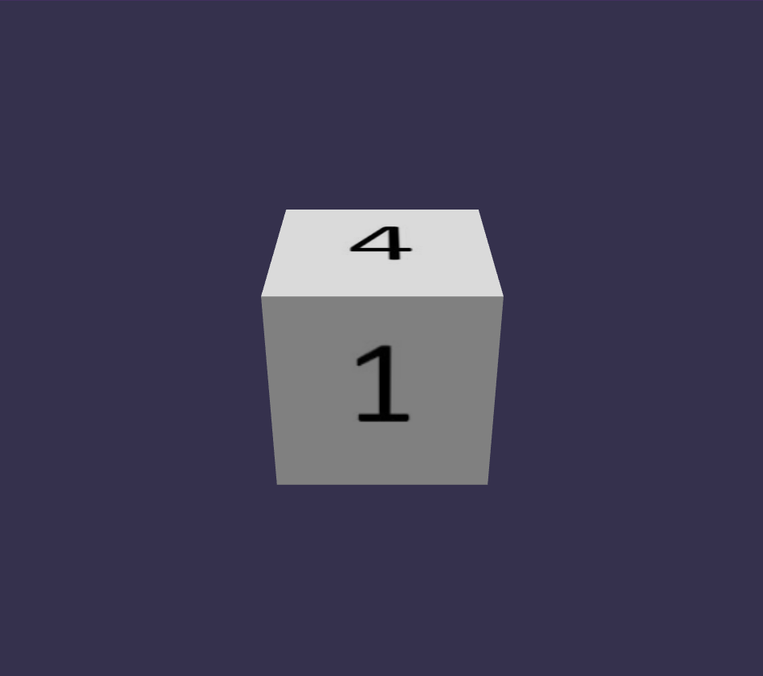

# Random Babylon Dice

A basic way of generating random dices on Babylon.js on the playground is given.

## Introduction

If you go to [this playground](https://playground.babylonjs.com/#6XIT28#5)
you will find similar code like the following:

```js
const createScene = () => {
  // Set up the scene
  const scene = new BABYLON.Scene(engine);
  const camera = new BABYLON.ArcRotateCamera(
    'Camera',
    -Math.PI / 2,
    Math.PI / 3,
    4,
    BABYLON.Vector3.Zero()
  );
  const light = new BABYLON.HemisphericLight(
    'light',
    new BABYLON.Vector3(1, 1, 0)
  );
  const mat = new BABYLON.StandardMaterial('mat');
  const texture = new BABYLON.Texture(
    'https://assets.babylonjs.com/environments/numbers.jpg'
  );
  camera.attachControl(canvas, true);
  mat.diffuseTexture = texture;

  // Generate the dice
  const columns = 6;
  const rows = 1;
  const faceUV = new Array(6);

  for (let i = 0; i < 6; i++) {
    faceUV[i] = new BABYLON.Vector4(
      i / columns,
      0,
      (i + 1) / columns,
      1 / rows
    );
  }

  const options = {
    faceUV: faceUV,
    wrap: true
  };
  const box = BABYLON.MeshBuilder.CreateBox('box', options);
  box.material = mat;

  // Scene is done
  return scene;
};
```

This yields a scene that looks like this:



The dice is exactly the same each time you run the code.

The little challenge is to generate a random dice when creating it.

## Analysis of the Problem

First, there's the code to set up the scene which is finished in the end by
adding the implementation of the cube or dice. That's the scene that is rendered
on the screen.

Then there's the other section to generate the dice. Notice that, the sprite
sheet with the numbers from 1 to 6 used to take each side of the cube is given
on the texture member. Next, in the for loop we select a sprite from the texture
to set it as a side of the dice. Thus, the only thing we'll do is to make that
selection arbitrary. Moreover, we need to make sure to select a unique random
face each time until we finish all the dice sides. 